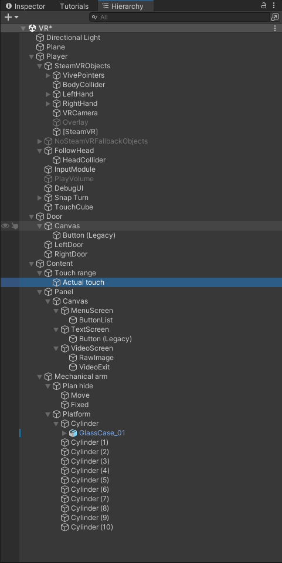

# 公转模型
眼前一扇巨大的机械大门，大门中央一个能量涌动的球体。 
按动身前的操作台按钮，能量球能量流转，启动大门打开。 
进入场景，身前会弹出全息的画框，展示内容菜单(内容框架)点击全息面板进行交互。 
选择菜单选项，对应的操作台旋转到画面前方。 
机械臂伸向画面前方，扫描出一段虚拟的机身部件。 
同时弹出知识点介绍。
##
* 设备：VIVE Cosmos.
* 软件：unity HDPR中 安装SteamVR Plugin、VIVE Input Utility.
* 插件：DOTween Pro、Advanced Dissolve(High Definition)、VFX Graph - Magic Orbs.
由于不知道什么情况，SteamVR会报错Apply WlU Action Set for SteamvR Input问题，因此后续使用SteamVR Input中的htc_viu.

## 脚本描述
### 自带
* eticlePoser主要负责射线交互，hitTarget是射线交互的物体。在其基础上添加了交互物体后，射线变色.
> Player/SteamVRObjects/VivePointers/Right/Reticle的ReticlePoser.cs
### 编写
* CharacterMovementControl主要负责VR角色的移动，碰撞.
* VivePointersControl主要负责射线的开关
* TouchRange主要负责碰撞物体、离开物体
* MoveOpenDoor主要负责开关门
* MenuBar主要负责Canvas屏
* MechanicalArm主要负责机械臂操控、圆盘旋转、Plane移动显示模型

 

## 制作过程

### Step 1

* 删掉初始摄像机，从SteamVR/InteractionSystem/Core/Prefabs里拖拽`Player`到Hierarchy中.

### Step 2

* 在Player里挂载组件 `Character Controller`(角色控制器)和添加脚本`CharacterMovementControl`.
>该脚本用于VR的移动和射线控制.

### Step 3

#### 添加射线
* 通过右键找到Prefab中的Unpack解锁Player模型，将HTC.UnityPlugin/ViveInputUtility/Prefabs里的`VivePointers`添加到Player下SteamVRObjects里.
#### 射线开关
* 复制一份GuideLine，并修改Material材质. 
* 添加脚本'VivePointersControl'到VivePointers下，并赋值手柄按键.
#### 射线红绿
* 修改Reticle中ReticlePoser脚本，添加 List<GameObject> interactive用存储交互物体，if控制射线的红绿.

### Step 4
* 在Hierarchy中，创建门Door.
#### Canvas配置
* 添加`Canvas-Button`，将Canvas中的Render Mode设置为World Space，将Canvas Scaler和Graphic Raycaster禁用，然后挂载自带的`Canvas Raycast Target`脚本，便于UI交互
#### 门的交互
* 添加脚本`MoveOpenDoor`到Door里，实现开关门移动.

### Step 5
* 在Hierarchy中，创建空对象Content.

### Step 6

#### 触碰器
* 创建Cube，用于告知触碰范围. 
* 子对象创建Cube，在Box Collider勾选Is Trigger(启动交互)，添加Rigidbody组件，勾选Is Kinematic(启动运动学). 
* 添加脚本'TouchRange'到子对象Cube，用于触碰后的操作.
#### Player添加触碰交互
* 创建Cube，用于地底触碰.

### Step 7

#### 面板
* 创建空对象Panel.
* 创建Canvas，放于Panel下。操作如上次一样，将Canvas中的Render Mode设置为World Space，将Canvas Scaler和Graphic Raycaster禁用，然后挂载自带的'Canvas Raycast Target'脚本，便于UI交互. 
* 创建Panel空对象，并添加脚本`MenuBar`. 
* 创建三个图片，分别是MenuScreen、TextScreen、VideoScreen.
>具体情况如分布

### Step 8

#### 机械臂
* 创建空对象Mechanical arm，并添加脚本'MechanicalArm'
* 创建子对象Plan hide和Platform
>Plan hide用于隐藏/显示某些物体
>Platform是平台，模型放于平台内

## 问题
### 震动问题
* SteamVR Input 修改

## 配图
### Hierarchy
